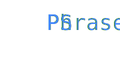

<div align='center'>

</div>
# PSPhrase

PowerShell module for generating unique and memorable passphrases

## Natural Language Passphrases 
---
Passwords are an unfortunate part of our everyday lives. If you're doing things right you likely have hundreds of passwords and hopefully you have a password manager.  How many times have you been in a position where you need one of these randomly generated passwords from your password manager but there's no option to copy/paste to your destination. Now you're stuck typing this:
```
hkUn9TBgf28%S0e$Qw#3zRO^
```
Phrases are so much easier to remember and transcribe. I.e. "The Quick Brown Fox Jumps" is a lot easier to remember and transcribe, but it still might be easily guessable.  I tried a handful of techniques for coming up with good passphrases instead of passwords but then I ran across this idea of a "natural language password." I started with the idea of generating them as closely in methodology to [Diceware](https://theworld.com/~reinhold/diceware.html) as I could but ended up changing it to a just a RNG. Ray Eads did a presentation on the concept of Natural Language Passwords for Linux Fest Northwest which you can watch [here](https://youtu.be/QW4tSTiDCT8) and I encourage you to do so. His database of nouns and adjectives is what powers this script which I believe he's maintaining here: <https://github.com/NaturalLanguagePasswords/system>

Originally I got a lot of help from [Tim Evans' blog](https://www.timmevans.net/blog/generating-diceware-passphrases-with-powershell/) on generating diceware passphrases with Powershell. Matt Graeber's blog post was a big influence on the random number generation: <https://powershellmagazine.com/2014/07/28/testing-the-effectiveness-of-get-random/>

These are all worth reading.
## PSPhrase  
PSPhrase is a module with one purpose: generating memorable passphrases. It's a crossplatform CLI tool for generating one, or many, passphrases that you can use to secure your assets.  
It has quite a few parameters for tailoring your preferences for the output passphrase.  
The function for generating a new passphrase(s) is Get-PSPhrase.
## Parameter Pairs
It generates Adjective/Noun pairs, this defines how many pairs you want returned. The default is 2 pair (two words)
## Paramter Count  
Specifies how many passphrases you'd like returned on execution. It can be nice to generate many so you can select the one that stands out the most to you.
## Parameter TitleCase
Switch parameter to toggle the use of title case. E.g. The First Letter Of Every Word Is Uppercase. 
## Parameter Substitution
Switch parameter to toggle common character substitution.  E.g. '3's for 'e's and '@'s for 'a's etc. 
## Parameter Prepend
Provide a string you would like prepended to the password output
## Parameter Append
Provide a string you would like appended to the password output
## Parameter Delimiter
This parameter accepts any string you would prefer as a delimiter between words. Defaults to a space.
## Parameter IncludeNumber
Switch parameter to randomly include a number within the passphrase
## Parameter IncludeSymbol
Switch parameter to randomly include a symbol within the passphrase  
  
## Settings  
Since there are a few parameters and you'll probably have a preference I thought it would be nice to have a way to save your preferred settings without having to leverage `$PSDefaultParameterValues` and put it in your profile.  
### Get-PSPhraseSetting  
If there are any currently saved PSPhrase settings you can retrieve them with this function.  Settings are stored per use on a given machine.  
### Set-PSPhraseSetting  
Takes all the same parameters as Get-PSPhrase but it saves the preferred values to a file.  These settings can be overridden when calling Get-PSPhrase by simply calling a specific parameter.  

